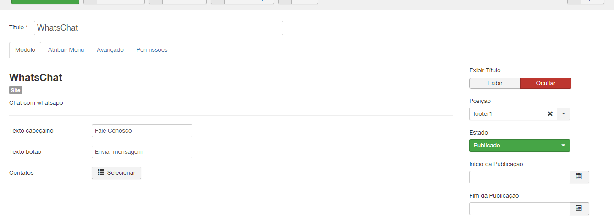
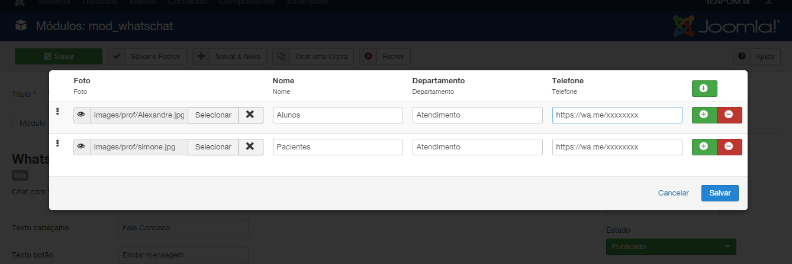

# WhatsChat
Módulo de chat para whatsapp com suporte para multiplos contatos e departamentos.

Não perca mais tempo fazendo com que seus usuários entrem em contato com a sua empresa tendo que digitar números de telefone. 

Com o módulo de chat para Whatsapp da nossa empresa, eles poderão entrar em contato com apenas um clique! 

Além disso, esse módulo oferece suporte para múltiplos contatos e departamentos, tornando a comunicação ainda mais rápida e eficiente. 

Não precisa mais copiar número e adicionar aos cnotatos para abrir novas conversas.

Com o módulo de chat para Whatsapp, tudo isso é possível de maneira simples e rápida. 

Não perca mais tempo e comece a utilizar o módulo de chat para Whatsapp da nossa empresa agora mesmo! 

Chat para Whatsapp, múltiplos contatos, departamentos, comunicação eficiente, atendimento ao cliente, integração com o Whatsapp, contato com apenas um clique.

## Instalação
Vídeo: https://youtu.be/3CwchZscwEM

## Site

## Administrator

## Instalação

Baixe os arquivos zipados e instale usando o instalador do Joomla.

## Versão para Joomla 3.x

[Baixar versão 1.3.0](https://github.com/albreis/joomla-whatschat/releases/tag/1.3.0)

## Versão para Joomla 4

[Baixar versão 2.1.0](https://github.com/albreis/joomla-whatschat/releases/tag/2.1.0)

## Suporte

ER Soluções Web LTDA

WhatsApp: [+55 19 9.8434-8618](https://wa.me/5519984348618) 

https://ersolucoesweb.com.br

